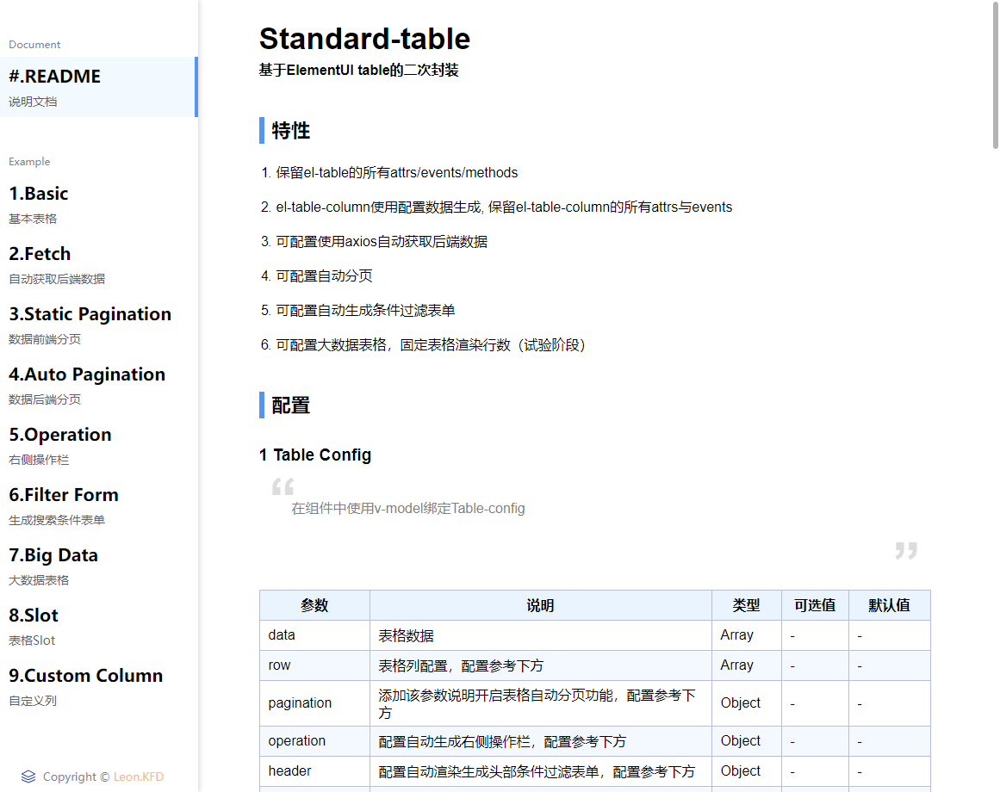

在线预览个人组件库: **<a href="https://kongfandong.cn/howdy" target="_blank">Howdy</a>**

## Markdown-loader

使用 **<a href="https://www.npmjs.com/package/markdown-loader" target="_blank">Markdown-loader</a>** 可以将markdown文件转为Html代码，直接在`vue.config.js`中加入webpack相关配置。并且使用 **<a href="https://highlightjs.org/" target="_blank">Highlight.js</a>** 对Markdown中出现的代码块进行高亮展示。Markdown-loader中可直接配置Highlightjs。

```js
const hljs = require('highlight.js')
module.exports = {
  configureWebpack: config => {
    config.module.rules.push({
      test: /\.md$/,
      use: [
        {
          loader: 'html-loader'
        },
        {
          loader: 'markdown-loader',
          options: {
            highlight: (code) => {
              if (code[0] === '<' || code.includes('template') || code.includes('script')) {
                return hljs.highlight('html', code).value
              } else if (code.includes('npm')) {
                return hljs.highlight('bash', code).value
              } else {
                return hljs.highlight('js', code).value
              }
            },
            // highlight: (code) => hljs.highlightAuto(code).value,
            pedantic: false,
            gfm: true,
            tables: true,
            breaks: false,
            sanitize: false,
            smartLists: true,
            smartypants: false,
            xhtml: false
          }
        }
      ]
    })
    // ... //
  }
}
```

这里本来是用了highlightAuto自动识别代码语言的，但是发现效果不太理想，所有直接通过判断里面出现关键内容应用不同代码语言。

然后就可以直接通过import将markdown文件引入到代码中。例如下面import引入了README.md文件，readme就是解析后的HTML代码，最后直接传给封装好的组件用v-html渲染出来即可。

```html
<template>
  <div id="Readme">
    <readme-frame :readme="readme"></readme-frame>
  </div>
</template>

<script>
import ReadmeFrame from '@/components/ReadmeFrame'
import readme from '@/howdy/packages/standard-table/README.md'
export default {
  name: 'readme',
  components: {
    ReadmeFrame
  },
  data () {
    return {
      readme
    }
  }
}
</script>
```

然后为渲染后的页面设定主题CSS，可以直接在网上找现成CSS代码，例如可Markdown编辑器 **<a href="http://theme.typora.io/" target="_blank">Typora</a>** 的主题。这里提供该组件库的主题CSS: <a href="./readme.css" target="_blank">readme.css</a>，样式如下图。




## 将Vue文件转为Markdown

编写一个nodejs脚本，将相关目标组件Example的Vue文件转成Markdown，然后通过上面Markdown-loader即可实现代码高亮展示。

```js
// vue-to-md.js
const fs = require('fs')
const glob = require('glob')
const classifys = fs.readdirSync('src/pages')
classifys.map(classify => {
  fs.mkdirSync(`src/code/${classify}`, { recursive: true })
})
glob('src/pages/**/example/example*.vue', (err, files) => {
  if (err) {
    throw err
  }
  files.map(file => {
    const codeFileName = file.replace('pages', 'code').replace('example/', '').replace('vue', 'md')
    const code = fs.readFileSync(file, 'utf8')
    const output = `
\`\`\`vue
  ${code}
\`\`\`
`
    fs.writeFileSync(codeFileName, output)
  })
})
```

> glob可以使用 “ * ” 通配符匹配所需文件

在`package.json`文件的vue启动与打包命令前加入运行该脚本的命令

```json
// package.json
"scripts": {
  "serve": "npm run vue-to-md && vue-cli-service serve",
  "build": "npm run vue-to-md && vue-cli-service build",
  "lint": "npm run vue-to-md && vue-cli-service lint",
  "vue-to-md": "node src/utils/vue-to-md.js"
}
```

通过路由匹配等逻辑，将生成的example.md文件引入到相关页面中。
```js
async loadCode () {
  try {
    let code = await import(`@/code/${this.mainName}/${this.page.replace(this.mainName + '-', '')}.md`)
    this.code = code.default
  } catch (e) {
    console.log(e)
  }
}
```

未完待续..


