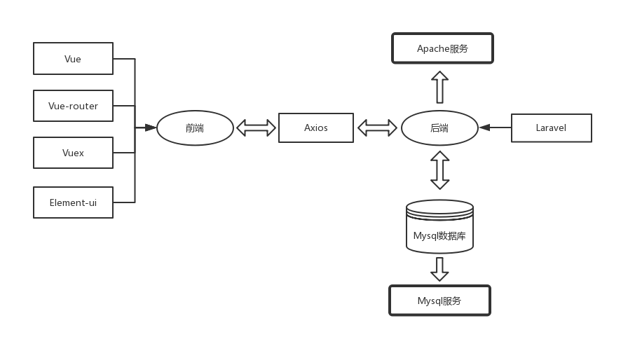
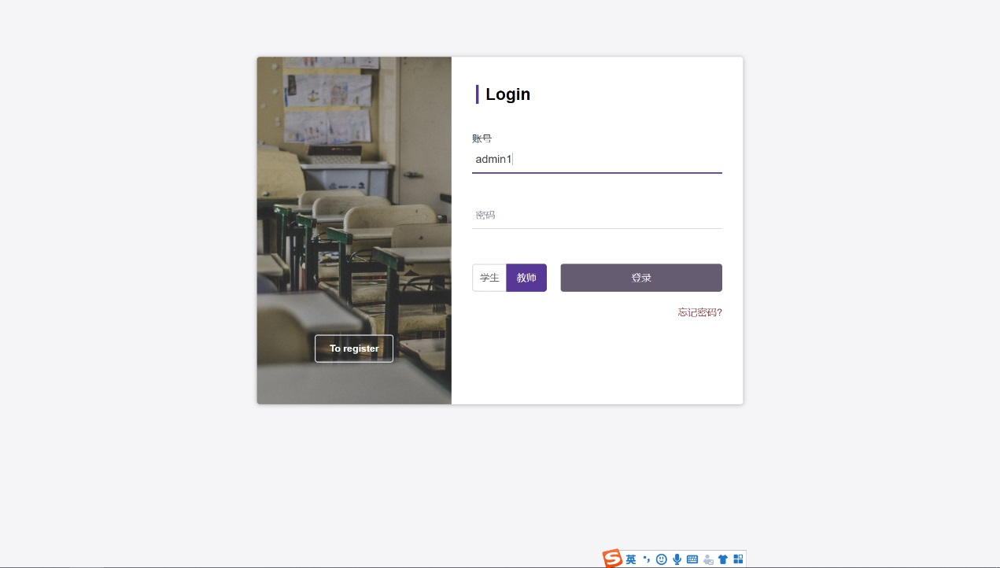
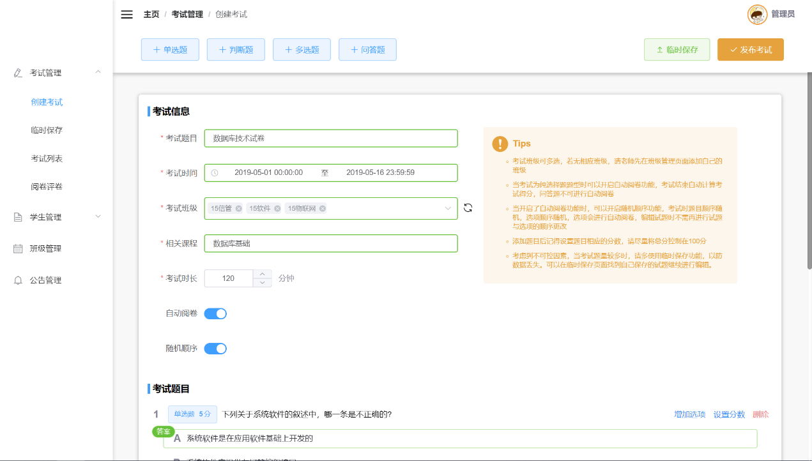
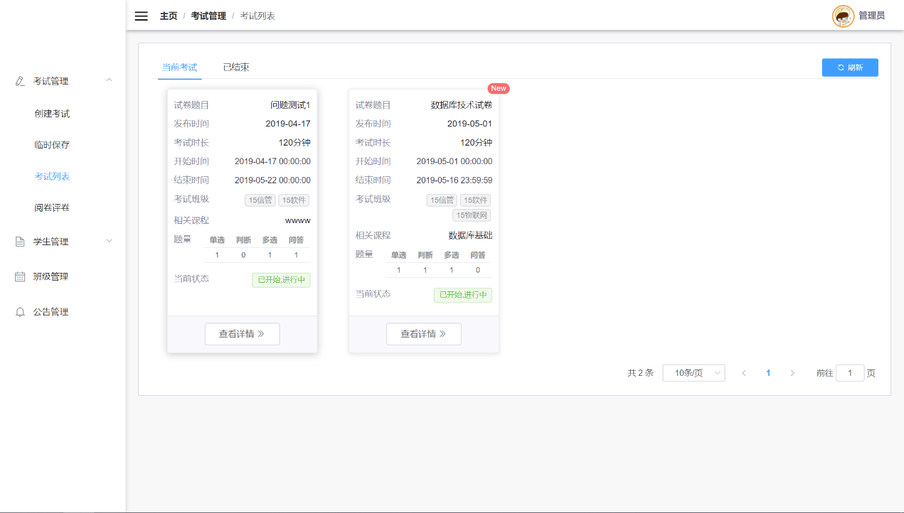
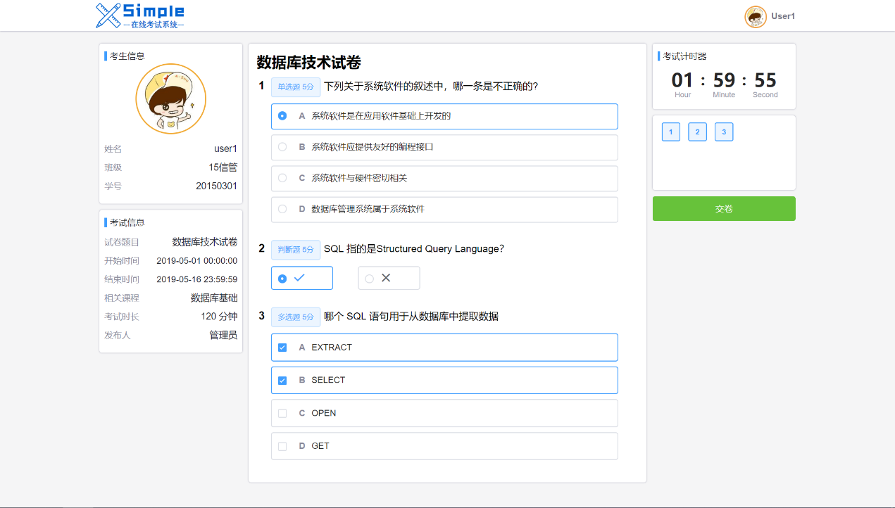
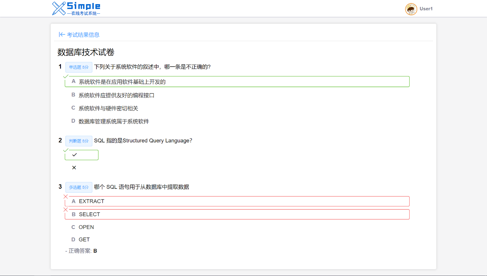

+ 该系统成品已部署与线上，在线访问：<a href="https://kongfandong.cn/exam/index.html" target="_blank">ExamSystem</a>
+ 系统线上环境部分功能已锁定
+ 学生端登录
  + 测试账号1: user1  密码: 7gzt9i0lkh
  + 测试账号2: user2  密码: lyufmklxy
+ 教师端登录
  + 测试账号: admin1  密码: qrmeke4p75


该系统为本人毕业设计，由于时间仓促，部分功能设计不太优雅，请见谅。  
以下截取于部分论文相关内容。

### 目录

1. [系统架构](#系统架构)
2. [技术选型](#技术选型)
3. [Axios拦截器](#Axios拦截器)
4. [Laravel相关](#Laravel相关)
5. [前端界面截图](#前端界面截图)

### 系统架构

**系统功能架构**

系统分为学生系统与教师系统，教师用户在登录页登录后自动跳转到教师系统首页，然后教师可以进行创建考试，创建的过程中可以对考试进行临时保存。把题目与考试班级等考试信息填写完毕后可以进行发布考试。这时学生用户登录到学生系统后，学生主页将会显示自己需要进行的考试列表或自己已经完成的考试列表。学生点击进入考试则可进行考试，在规定时间内完成考试后进行交卷。提交试卷后，将会弹出自动阅卷结果，学生可以进入查看自己的答卷与分数。与此同时，教师系统可获取到学生完成考试的列表，教师可以查看学生的成绩与答卷，并对需要进行阅卷的考试进行阅卷。教师系统提供一个公共功能，教师可以发布、编辑、删除公告，发布的公告将展示在学生系统上。


**系统技术架构**



### 技术选型
本研究中，总体采用前后端分离的技术进行开发。前端使用近年流行的MVVM框架Vue，同时使用其附属的Vue-router路由管理模块和Vuex状态管理模块。UI将采用Element-ui框架，系统将采用部分响应式布局设计。

前端使用axios工具，其基于Ajax技术开发，前端可通过它把所有需要的动态数据以JSON格式请求后端，同时获取后端返回到的JSON数据。再将动态数据经过逻辑处理渲染到页面中。

后端总体采用PHP技术开发，使用PHP的MVC框架Laravel，其具有路由、中间件、查询构造器等功能。本次后端仅作为API服务器，并不会直接使用后端的View视图层。

数据库方面采用Mysql数据库，基于其能与PHP语言友好结合，运行速度快，提供事务处理功能的特点。同时，关系型数据库，能方便的处理在线考试系统模型关联问题。

### Axios拦截器
配置Axios拦截器，可以在请求之前和请求之后作统一处理。每一个后端请求都需要默认传送一个token作为身份认证。所以前端在请求前，可以统一配置这个token，默认为每个请求自动拼上token字段。

后端每个请求都会返回错误码与请求信息，前端Axios可以对每个响应进行统一处理。例如，字段码为200则说明请求成功，其他字段码均为错误请求，可以为错误请求统一弹出错误信息。

同时本次用拦截器加入了一个取消重复请求与切换路由自动取消之前路由未完成请求的功能。

**axios.js**
```js{3,16,46}
const baseURL = process.env.NODE_ENV === 'production' ? './api' : './api/api'
// 创建实例
const instance = axios.create({
  baseURL,
  timeout: 90000,
  headers: {
    'Content-Type': 'application/json'
  }
})
let axiosPendingList = [] // 记录请求
// 请求拦截
instance.interceptors.request.use((config) => {
  let mark = config.url
  let markIndex = axiosPendingList.findIndex(item => item.name == mark)
  if (markIndex > -1) {
    axiosPendingList[markIndex].cancel('重复请求')
    axiosPendingList.splice(markIndex, 1)
  }
  const CancelToken = axios.CancelToken
  const source = CancelToken.source()
  config.cancelToken = source.token
  config._mark = mark
  axiosPendingList.push({
    name: mark,
    cancel: source.cancel
  })
  let token = sessionStorage.getItem('token') || ''
  if (token) {
    if (config.data) {
      config.data.token = token
    } else {
      config.data = {}
      config.data.token = token
    }
  }
  if (config.method === 'post' && config.headers['Content-Type'] !== 'application/json') {
    config.data = qs.stringify(config.data)
  }
  return config
})
// 响应拦截
instance.interceptors.response.use(
  response => {
    let markIndex = axiosPendingList.findIndex(item => item.name == response.config._mark)
    if (markIndex > -1) {
      axiosPendingList.splice(markIndex, 1)
    }
    let data = response.data
    if (data.code === 200) {
      return data.data
    } else {
      if (data.code === 300) {
        Message({
          showClose: true,
          message: data.message,
          type: 'error',
          duration: 2000
        })
        router.push('/login')
      } else if (data.message) {
        Message({
          showClose: true,
          message: data.message,
          type: 'error',
          duration: 2000
        })
      }
      return Promise.reject(response)
    }
  },
  err => {
    if (!err.message === '重复请求') {
      Message({
        showClose: true,
        message: 'Api访问失败，请检查网络..',
        type: 'error',
        duration: 1500
      })
      return Promise.reject(err)
    }
  }
)
export {
  baseURL,
  axiosPendingList
}
export default instance
```

**router.js**
```js
...
// 路由守卫拦截，切换路由取消未完成请求
router.beforeEach((to, from, next) => {
  axiosPendingList.map(item => {
    if (!item.notAllowCancel) {
      item.cancel()
    }
  })
  next()
})
...
```

### Laravel相关

#### 中间件

本项目采用前后端分离方式开发，以Token形式保存当前的用户信息。Token可分为学生Token和教师Token，每一个请求都会带有Token以识别当前的用户。所以我们可以设置一些请求中间件，在每次请求前统一对Token进行处理。
**CheckToken.php**
```php
...
class CheckToken
{
  /**
  * Handle an incoming request.
  *
  * @param  \Illuminate\Http\Request  $request
  * @param  \Closure  $next
  * @return mixed
  */
  public function handle($request, Closure $next)
  {
    $token = $request -> input('token');
    $now = date('Y-m-d H:i:s');
    $token_row = Token::where([['token', '=', $token],['overdue_after', '>', $now]]);
    if ($token_row->exists()) {
      // 更新Token过期时间
      $update_overdue = date('Y-m-d H:i:s', strtotime("+2 hour"));
      $token_row->update(['overdue_after' => $update_overdue]);
      return $next($request);
    } else {
      return response(Response::loginError());
    }
  }
}
...
```

#### 查询构造器

使用Laravel提供的查询构造器功能，能够方便的让我们的SQL语句变得简单，查询数据库数据更加快速。它使用PDO连接方式连接数据库，并且通过封装可以有效的防止SQL注入攻击。

查询构造器语法什么简洁，并且采用拼接的方式组成。例如：table(‘user’)->get()，它将别转换为select * from user的SQL命令。在可以运行原生SQL的同时，对SQL的所有命令都有对其进行进一层封装，例如条件语句、连接查询、排序、分组、Limit等，同时它扩展了同时多个插入更新、Exists、悲观锁等功能。

使用查询构造器查询出来的数据记录为Laravel特有的集合类型，Larvel为集合类型封装了很多简便快捷的数据处理方法API，例如map（遍历）、filter（过滤）、diff（比较）、forPage（快速分页）、groupBy（快速分组）等等。

#### 事务处理
Laravel框架对Mysql的事务处理进行了有效方便的封装，可以让我们对数据库进行开启事务处理功能。开启事务，可以有效地防止数据库方式死锁。在本在线考试系统中，教师可以对正在创建的考试进行临时保存，在进行重新编辑并重新保存时，需要先删除当前该试卷已保存的试题记录，然后再插入修改后的试题记录。这时候在删除和插入的过程中，有可能会发生数据库数据未能正常删除，然后插入了相同ID记录，形成数据表错误或发生死锁。所有，我们可以对删除和插入构成同一个事务，只有当删除和插入都没异常时再进行事务提交，若有异常则进行回滚。

使用DB::beginTransaction()开启事务，然后把所有数据库操作放在一个try模块下，在try模块最后使用DB::commit()进行事务提交，然后catch模块写入回滚代码DB::rollBack()。

本次研究中，项目中在学生提交考试、教师编辑临时保存考试、教师发布考试、教师编辑班级等模块操作中都有使用相应事务处理功能。

#### 响应体封装
**Response.php**
```php
class Response extends Model
{
  public static function success() {
    $result = array(
      'code' => 200,
      'message' => '操作成功'
    );
    echo json_encode($result, JSON_UNESCAPED_UNICODE);
    exit;
  }
  public static function successMsg($message = '') {
    $result = array(
      'code' => 200,
      'message' => $message
    );
    echo json_encode($result, JSON_UNESCAPED_UNICODE);
    exit;
  }
  public static function successData(
    $data = array(), 
    $message = '数据获取成功'
  ) {
    $result = array(
      'code' => 200,
      'message' => $message,
      'data' => $data
    );
    echo json_encode($result, JSON_UNESCAPED_UNICODE);
    exit;
  }
  public static function successPage(
    $items = array(), 
    $page = 1, 
    $pageSize = 10, 
    $total = 0, 
    $message='数据获取成功'
  ) {
    $result = array(
      'code' => 200, 
      'message' => $message,
      'data' => [
        'items' => $items,
        'page' => $page,
        'pageSize' => $pageSize,
        'total' => $total
      ]
    );
    echo json_encode($result, JSON_UNESCAPED_UNICODE);
    exit;
  }
  public static function loginError() {
    $result = array(
      'code' => 300,
      'message' => '登录状态异常'
    );
    echo json_encode($result, JSON_UNESCAPED_UNICODE);
    exit;
  }
  public static function parameterError() {
    $result = array(
      'code' => 301,
      'message' => '参数错误'
    );
    echo json_encode($result, JSON_UNESCAPED_UNICODE);
    exit;
  }
  public static function error($code = 302 , $message = '') {
    if(!is_numeric($code)) return;
    $result = array(
      'code' => $code,
      'message' => $message
    );
    echo json_encode($result, JSON_UNESCAPED_UNICODE);
    exit;
  }
}
```

### 前端界面截图

**登录界面**


**创建考试**


**成绩管理**


**考试管理**


**考试**


**考试结果**


由于时间仓促，本次开发的系统虽然基本功能已经完成，但仍有很大的提升空间。

*以上内容未经授权请勿随意转载。*

系统在线访问：<a href="https://kongfandong.cn/exam/index.html" target="_blank">ExamSystem</a>
