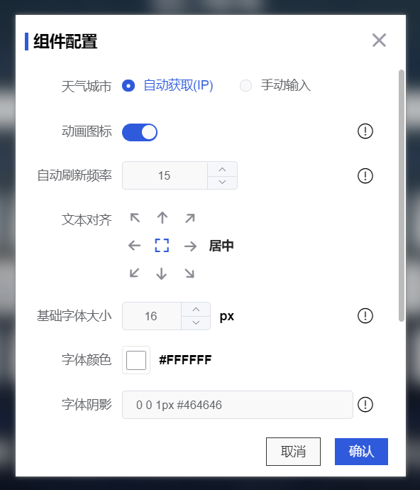

## 前言

**[Howdz](https://howdz.vercel.app)**是基于`Vue3`开发的一个完全自定义配置的浏览器导航起始页，支持按需添加物料组件，可自由编辑组件的位置、大小与功能。支持响应式设计，可自定义随机壁纸、动态壁纸等。项目提供网页在线访问、打包出浏览器插件、打包出桌面应用(Electron)等访问方式。

本文记录项目开发中使用的相关技术。

## 表单封装

项目中运行自由添加各种物料组件，而每一个物料组件都含有自己的配置项表单，而其中又有部分相同的配置项，所以可以实现一个JS数据驱动的表单封装。

当前使用了`ElementPlus`框架，封装了一个StandardForm组件，为其传入`formData`与`formConf`两个属性即可生成双向绑定的表单，支持`JSX`插入其他自定义组件。因篇幅问题，组件封装代码可参考此处: [standard-form.vue](https://github.com/leon-kfd/Dashboard/blob/main/src/plugins/standard-form/src/standard-form.vue)

然后可以使用类似JSON的格式，实现各个物料组件的配置表单，例如`Weather`组件的`setting.tsx`如下：

```tsx
// @/materials/Weather/setting.tsx
import pick from '../base' // pick可以自由选取公用的配置
export default {
  formData: {
    weatherMode: 1,
    cityName: '',
    animationIcon: true,
    duration: 15,
    position: 5,
    baseFontSize: 16,
    textColor: '#262626',
    textShadow: '0 0 1px #464646',
    iconShadow: '0 0 1px #464646',
    fontFamily: '',
    padding: 10
  },
  formConf (formData: Record<string,any>) { // 传入formData以实现双向绑定
    return {
      weatherMode: {
        label: '天气城市',
        type: 'radio-group',
        radio: {
          list: [{ name: '自动获取(IP)', value: 1 }, { name: '手动输入', value: 2 }],
          label: 'name',
          value: 'value'
        }
      },
      cityName: {
        when: (formData: Record<string,any>) => formData.weatherMode === 2, // 类似v-if
        type: 'input',
        attrs: { placeholder: '请输入城市名(目前仅支持中国城市名)', clearable: true },
        rules: [{
          required: true,
          validator: (rule: unknown, value: string, callback: (e?:Error) => void) => {
            formData.weatherMode === 2 && !value ? callback(new Error('请输入城市名')) : callback()
          } 
        }] // 支持el-form原生rule
      },
      animationIcon: {
        label: '动画图标',
        type: 'switch',
        tips: '默认使用含动画的ICON，若想提高性能可关闭使用静态ICON'
      },
      duration: {
        label: '自动刷新频率',
        type: 'input-number',
        attrs: { 'controls-position': 'right', min: 5, max: 12 * 60 }, 
        tips: '刷新频率,单位为分钟'
      },
      ...pick(formData, [ // 选取公用的配置
        'position',
        'baseFontSize',
        'textColor',
        'textShadow',
        'iconShadow',
        'fontFamily',
        'padding'
      ])
    }
  }
}
```



## 右键菜单

物料组件添加后，在编辑模式下可以右键弹出菜单更改配置或删除等。右键菜单的实现来源与笔者开源的`@howdjs/mouse-menu`。同时在本项目中，为了兼容移动端，对插件进行了二次封装，为其添加了长按弹出菜单的功能。二次封装代码[参考此处](https://github.com/leon-kfd/Dashboard/blob/main/src/plugins/mouse-menu.ts)。

项目中采用的是`vue指令`的方式使用，菜单插件可以接收任意参数进行回调，所以可以把点击的物料组件数据传到回调中进行各种操作。

```html
<template>
	<div v-for="element in affix" :key="affix.id">
		<div v-mouse-menu="{ disabled: () => isLock, params: element, menuList }">
			<!--Material code-->
		</div>
	</div>
</template>
<script>
setup () {
	const isLock = computed(() => store.state.isLock)
	const menuList = ref([
		{ label: '基础配置', tips: 'Edit Base', fn: (params: ComponentOptions) => emit('edit', params.i) },
		{ label: '删除', tips: 'Delete', fn: (params: ComponentOptions) => store.commit('deleteComponent', params) }
	])
	// fn中的params为组件数据
}
</script>
```


## 物料组件布局

当前提供2中布局方式，一种是基于类文件流的栅格布局，这种布局会让组件一个接一个排列，另外一个是Fixed布局，可以让组件固定与页面任意位置。

### 栅格模式
栅格模式使用[vue-grid-layout](https://github.com/jbaysolutions/vue-grid-layout)实现，该插件vue3版本处于Beta中。

```html
<template>
	<grid-layout v-model:layout="list" :col-num="12" :row-height="rowHeight" :is-draggable="!isLock" :is-resizable="!isLock">
		<grid-item v-for="item in list" :x="item.x" :y="item.y" :w="item.w" :h="item.h" :i="item.i">
			<!--Material code-->
		</grid-item>
	</grid-layout>
</template>
<script>
setup () {
	const isLock = computed(() => store.state.isLock)
	const list = computed({
		get: () => store.state.list,
		set: (val) => { store.commit('updateList', val) }
	})
}
</script>
```

使用`v-model:layout`双向绑定栅格模式物料组件列表数据，因为物料数组存在vuex中，这里用`computed`的setter进行更新。`isLock`是用于判断当前是否处于编辑模式，在锁定状态下禁用拖拽与大小更改。当前使用的栅格数为12，即将屏幕宽度分割为12份。


### Fixed模式
Fixed模式使用笔者自己开源的[@howdjs/to-control](https://kongfandong.cn/howdy/to-control)插件完成，可以让物料组件固定在页面的任何位置中，也支持拖拽右下角更改大小。

```html
<template>
	<div
		v-for="element in affix"
		v-to-control="{
			positionMode: element.affixInfo.mode,
			moveCursor: false,
			disabled: () => isLock,
			arrowOptions: { lineColor: '#9a98c3', size: 12, padding: 8 }
		}"
		:key="element.id"
		@todragend="handleAffixDragend($event, element)"
		@tocontrolend="handleAffixDragend($event, element)"
	>
		<!--Material code-->
	</div>
</template>
<script>
setup () {
	const isLock = computed(() => store.state.isLock)
	const affix = computed(() => store.state.affix)
	const handleAffixDragend = ($event: any, element: ComponentOptions) => {
		const mode = element.affixInfo?.mode || 1
		const { left, top, bottom, right, width, height } = $event
		const _element = JSON.parse(JSON.stringify(element))
		_element.affixInfo.x = [1, 3].includes(mode) ? left : right
		_element.affixInfo.y = [1, 2].includes(mode) ? top : bottom
		if (width && height) {
			_element.w = width
			_element.h = height
		}
		store.commit('editComponent', _element)
	}
}
</script>
```

与栅格模式不同，这里是使用事件回调函数对组件的Vuex数据进行更新。也是使用`isLock`判断组件是否锁定。插件支持更改定位方向，记录在右上角、右下角等，这样对响应式布局很有效。更多用法可参考: [@howdjs/to-control](https://kongfandong.cn/howdy/to-control/example3)


## 获取任意网站Favicon

## 交互弹窗Popover

