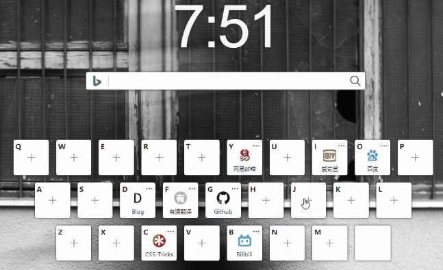

一个浏览器首页站点, 包含可切换的常用搜索引擎搜索功能, 键盘布局添加快捷收藏网站, 并加入键盘按键监听可快速打开, 自定义背景图, 账号同步数据等功能

系统半成品已部署与线上，在线访问：<a href="http://s.kongfandong.cn" target="_blank">http://s.kongfandong.cn</a>

### 搜索引擎切换功能

该功能时为了便于让用户可快速切换不同的搜索引擎，可以涉及不同领域的搜索，例如常用引擎、视频、翻译等搜索。在搜索框聚焦状态下按Tab键就可按用户规定的顺序快速切换引擎（Shift + Tab向上切换）。
```js
handleInputKeyDown (e) {
  if (e.keyCode === 9) {
    if (e.shiftKey) {
      this.activeEngine = this.activeEngine <= 0 ? this.$store.state.engineList.length - 1 : --this.activeEngine
      e.preventDefault()
    } else {
      this.activeEngine = this.activeEngine >= this.$store.state.engineList.length - 1 ? 0 : ++this.activeEngine
      e.preventDefault()
    }
  }
  if (e.keyCode === 13) {
    window.open(this.$store.state.engineList[this.activeEngine].link + encodeURIComponent(this.searchKey))
  }
}
```

寻找目前主流搜索引擎关键字拼接规则记录列表和寻找Icon保存到VUEX中，目前设置了默认引擎为Bing国内、国外、百度，然后备用设置了Google、搜狗、Bilibili、淘宝等。用户可以在设置页通过拖拽切换引擎顺序与添加备用搜索到当前。

拖拽功能使用vuedragable实现，将当前引擎与备用引擎设为同一个group，即可让两者可以互相拖拽，并且通过pull设置实现当engineList长度为1是不可再向外拖出。
```html{4, 22}
...
<div class="text">当前引擎组</div>
<draggable :list="engineList"
            :group="{ name: 'engine',pull: engineList.length > 1 }"
            @end="handleDragEnd">
  <transition-group type="transition"
                    name="flip-list"
                    class="now-engine-list engine-list">
    <div class="engine-list-item"
          v-for="item in engineList"
          :key="item.name">
      
      <div class="text">{{item.name}}</div>
    </div>
  </transition-group>
</draggable>
<div class="text">备用引擎组</div>
<draggable :list="backupEngineList"
            group="engine"
            @end="handleDragEnd">
  <transition-group type="transition"
                    name="flip-list"
                    class="backupEngineList engine-list">
    <div class="engine-list-item"
          v-for="item in backupEngineList"
          :key="item.name">
      
      <div class="text">{{item.name}}</div>
    </div>
  </transition-group>
</draggable>
...
```

### 键盘收藏夹功能

用户可通过点击模拟键盘按键快速跳转到收藏好的网站，未设置时点击则弹窗让用户添加。

主要功能实现：
1. 截取用户输入的http地址中的域名，然后通过“域名 + /favicon.ico”获取主流网站的Icon，当获取不到时，使用截取Title的首字符作为Icon。亦可使用谷歌的Favicon服务，通过“http://www.google.cn/s2/favicons?domain= + 域名”获取网站Icon，但获取出来的都是固定16px x 16px大小。
2. 使用Flex布局实现模拟键盘布局
3. 监听按键添加事件，window.open打开用户收藏的网站
4. 使用个人组件<a href="http://kongfandong.cn/pratice/animation-dialog" target="_blank">Animation Dialog</a>实现动画弹窗(Where open where close交互)

```html

<div class="no-icon">{{userSettingKeyMap[key].remark.slice(0,1)}}</div>
```




### 背景图切换功能

背景图使用的图片来自免费无版权图片壁纸网站<a href="https://unsplash.com/" target="_blank">Unplash</a>，并使用其提供的<a href="https://unsplash.com/documentation" target="_blank">API服务</a>获取JSON图片列表。其Api接口不可直接调用，需要注册获取到accessKey之后将其放在请求中才可使用接口服务，且普通用户每小时只可调用50次，因此不合适直接把获取unsplash图片的请求放在前端。

#### 后端实现

后端使用Nodejs每天定时调用1次获取Unsplash最新图片的接口，并把返回数据保留为json文件，然后由Nodejs提供接口，即背景图片以天为单位更新。
```js
// Nodejs后端服务
const { unsplashApiKey } = require('../config/config') // 调用UnsplashAPI的Access Key
const schedule = require('node-schedule') // nodejs定时器服务
...
// 获取Unsplash最新图片
const getUnsplashPhotos = async () => {
  const pageSize = 30
  const photosList = []
  try {
    for (let page = 1; page <= 4; page++) {
      const url = `https://api.unsplash.com/photos?page=${page}&per_page=${pageSize}&client_id=${unsplashApiKey}`
      const { data } = await axios.get(url)
      const result = data.filter(item => {
        return item.width > item.height
      }).map(item => {
        const { id, width, height, color, description, urls, links } = item
        return { id, width, height, color, description, urls, links }
      })
      photosList.push(...result)
    }
    const today = getToday()
    const info = {
      date: today,
      num: photosList.length,
      list: photosList
    }
    const data = JSON.stringify(info, null, '\t')
    fs.writeFileSync(`./unsplash/${today}.json`, data)
    logger('定时获取Unsplash图片')
  } catch (e) {
    logger('定时获取Unsplash图片', 0, e)
  }
}
...
// 获取今日图片
router.get('/photos', async ctx => {
  const fileList = fs.readdirSync('./unsplash').sort((a, b) => {
    const [date1] = a.split('.')
    const [date2] = b.split('.')
    return new Date(date2) - new Date(date1)
  })
  const latest = fileList[0]
  const txt = fs.readFileSync(`./unsplash/${latest}`, 'utf-8')
  try {
    const data = JSON.parse(txt)
    ctx.body = r.successData(data)
  } catch (e) {
    ctx.body = r.error(308, e)
  }
})
...
// 每天1点定时获取Unsplash图片保存JSON
const runUnsplashSchedule = () => {
  schedule.scheduleJob('0 1 1 * * *', () => {
    getUnsplashPhotos()
  })
}
runUnsplashSchedule()
...
```

#### 前端处理

前端使用Vuex保留用户每次切换获取的图片缓存，在不刷新页面下，同一张图片不需要再次加载。本来是想将获取到的图片转成Base64保存到Localstorage里面的，但浏览器Localstorage最大存储5M，Unsplash一张2K的图片转成Base64会超出5M所以放弃了这个方案。

关于获取图片资源，一开始是使用new Image()方案然后监听onload事件用canvas将Img转成Base64来实现。但是后面发现canvas将Unsplash图片转成base64会有跨域问题，尽管将<a href="https://www.jianshu.com/p/473cc1ec0b7e" target="_blank">Img的crossOrigin属性设成'anonymous'</a>，在Chrome下没问题，但是用Safari依然报跨域。最后采用了另外一种方案，使用Ajax去加载图片资源。需要将responseType改为arraybuffer方式，然后读取二进制拼接成base64。使用Ajax方式还有一个优点，就是可以获取到加载进度，直接用img的src去获取无法监听图片下载进度。

**ajax获取图片为base64**
```js{7}
// ajax读取图片为base64
// processFn为监听进度的回调
export const getBase64ByAjax = (url, formatter = 'image/png', processFn) => {
  return new Promise((resolve, reject) => {
    const xhr = new XMLHttpRequest()
    xhr.open('GET', url, true)
    xhr.responseType = 'arraybuffer'
    xhr.onload = (e) => {
      if (xhr.status === 200) {
        const uInt8Array = new Uint8Array(xhr.response)
        let i = uInt8Array.length
        const binaryString = new Array(i)
        while (i--) {
          binaryString[i] = String.fromCharCode(uInt8Array[i])
        }
        const data = binaryString.join('')
        const base64 = window.btoa(data)
        const dataURL = 'data:' + (formatter || 'image/png') + ';base64,' + base64
        resolve(dataURL)
      }
    }
    xhr.onerror = (e) => {
      reject(e)
    }
    xhr.onprogress = (e) => {
      processFn && processFn(e)
    }
    xhr.send()
  })
}
```

**Vuex记录图片加载及其缓存**
```js
export default new Vuex.Store({
  state: {
    // ... //
    unsplashImgList: [],
    downloadingImgInfo: null,
    downloadingImgBase64: '',
    downloadingProcess: 0,
    cacheImg: {}
    // ... //
  },
  mutations: {
    // ... //
    setUnsplashImgList (state, unsplashImgList) {
      state.unsplashImgList = unsplashImgList
    },
    setDownloadingImgInfo (state, downloadingImgInfo) {
      state.downloadingImgInfo = downloadingImgInfo
    },
    setDownloadingProcess (state, downloadingProcess) {
      state.downloadingProcess = downloadingProcess
    },
    setDownloadingImgBase64 (state, base64) {
      document.body.style.setProperty('--textColor', base64 ? '#f8f8f9' : '#262626')
      document.body.style.setProperty('--textShadowColor', base64 ? '#262626' : 'transparent')
      state.downloadingImgBase64 = base64
    },
    setCacheImg (state, { imgId, base64 }) {
      state.cacheImg = {
        ...state.cacheImg,
        [imgId]: base64
      }
    }
    // ... //
  },
  actions: {
    // ... //
    getDownloadingImg ({ commit, state }, downloadingImg) {
      const imgId = downloadingImg.id
      if (state.cacheImg[imgId]) {
        commit('setDownloadingImgBase64', state.cacheImg[imgId])
      } else {
        let imgURL
        // 判断小屏获取宽度小一点的图片
        if (document.body.clientWidth >= 1440) {
          imgURL = downloadingImg.urls.regular.replace('w=1080', 'w=1920').replace('q=80', 'q=70')
        } else {
          imgURL = downloadingImg.urls.regular.replace('q=80', 'q=70')
        }
        commit('setDownloadingImgInfo', downloadingImg)
        commit('setDownloadingProcess', 0)
        const processFn = (e) => {
          const process = ~~(e.loaded / e.total * 100)
          commit('setDownloadingProcess', process)
        }
        getBase64ByAjax(imgURL, 'image/png', processFn).then(data => {
          const dataURL = data
          commit('setDownloadingImgBase64', dataURL)
          commit('setCacheImg', { imgId, base64: dataURL })
          commit('setDownloadingImgInfo', null)
          const userTodayImgInfo = {
            ...downloadingImg,
            date: getToday()
          }
          localStorage.setItem('userTodayImgInfo', JSON.stringify(userTodayImgInfo))
        })
      }
    }
    // ... //
  }
})
```


未完待续...


