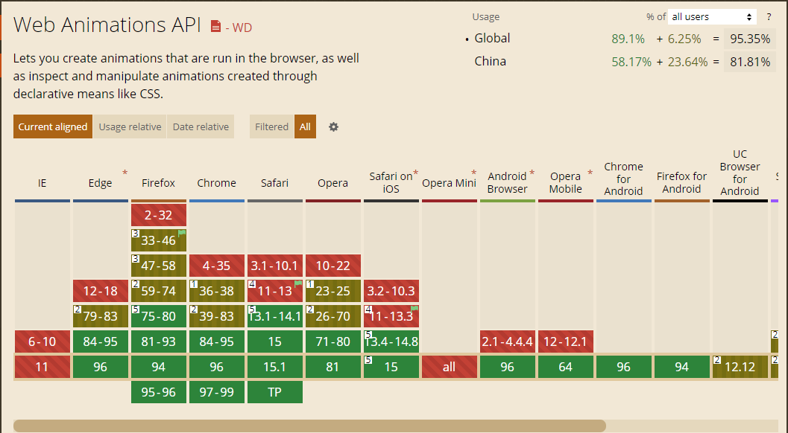
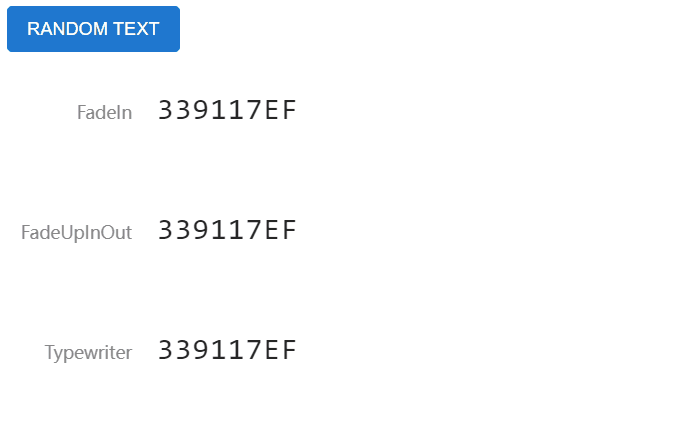

在网页添加一些简单的切换动画一般使用CSS3的animation或者transition实现，而Element.animate是新的原生Javascript Api，能使用JS快速为Dom添加动画。

## 前言

为了增加网站的用户体验，在很多场景下一般可以为元素的切换添加一下转场动画。

最简单的方法，一般可以使用CSS的`transition`或者`animation`实现。当前也有很多CSS动画库，例如[animate.css](https://animate.style/)，它与[wow.js](https://wowjs.uk/)搭配使用经常用于很多产品宣传首页。

当然我们也可以使用一些主流的JS动画库操作某些元素的单独动画，例如：[Velocity](https://github.com/julianshapiro/velocity)、[Anime.js](https://github.com/juliangarnier/anime)等。或者更传统的`Jquery`也有提供[.animate](https://api.jquery.com/animate/)操作动画的方案。

而本文则介绍一下原生较新的Javascript Api: **[Element.animate()](https://developer.mozilla.org/en-US/docs/Web/API/Element/animate)**

## 关于Element.animate()

[Element.animate()](https://developer.mozilla.org/en-US/docs/Web/API/Element/animate)，是`Web animation`提供的解决方案。

### 参数

`Element.animate(keyframes, options)`方法接收2个参数，第一个为`keyframes`，第二个为`options`

`keyframes`：与CSS3的keyframes的概念是一致的，代表关键帧的集合。它可以接收一个关键帧数组，也可以简写成一个对象。具体写法请参考[Keyframe Formats (MDN)](https://developer.mozilla.org/zh-CN/docs/Web/API/Web_Animations_API/Keyframe_Formats)与下文的案例使用。

`options`: 动画的相关配置。其接收`delay`, `duration`, `easing`, `iterations`等配置参数，其与CSS动画属性也保持一致，更多参数请参考[KeyframeEffect (MDN)](https://developer.mozilla.org/en-US/docs/Web/API/KeyframeEffect/KeyframeEffect)。

这个方法会返回一个[Animation](https://developer.mozilla.org/zh-CN/docs/Web/API/Animation)实例，通过这个实例我们可以对动画进行暂停、取消、读取执行状态等。或者通过`.finished`返回Promise来对执行完动画进行下一步操作。

### 兼容性

因为该API较新，所以对传统的浏览器支持并不友好，所有IE浏览器都不支持。在[Can I use](https://caniuse.com/?search=Element.animate)上查询如下：



但是只要简单使用`if (dom.animate) {}`包裹即可向下兼容，对一些不支持的浏览器不执行动画就可以。

## 使用案例

### 文字动画特效

简单写了三种文字动画特效
+ FadeIn：渐变进入
+ FadeUpInOut: 旧文本先淡出新文本再淡入
+ Typewriter: 打字机特效



**淡入淡出**

`Effect1`和`Effect2`是更改`opactity`与`translate`属性实现的文字淡入淡出动画。

```html
<div class="text-wrapper" id="Effect1"></div>
<div class="text-wrapper" id="Effect2"></div>
<script>
// ...省略事件绑定等代码
function animateEffect1(text) {
  const target = document.querySelector("#Effect1");
  target.innerText = text;
  // 使用对象简写写法opactiy from 0, to 1， 执行时间600ms
  target.animate({ opacity: [0, 1] }, 600); 
}
async function animateEffect2(text) {
  const target = document.querySelector("#Effect2");
  // finished返回Promise，可等待文本淡出动画执行完再执行新文本淡入动画
  await target.animate({
    opacity: [1, 0],
    transform: ["translateY(0)", "translateY(-20px)"],
  },300).finished;
  target.innerText = text;
  target.animate(
    {
      opacity: [0, 1],
      transform: ["translateY(20px)", "translateY(0)"],
    },
    300
  );
}
</script>
```

**打字机**

`Effect3`实现了一个文字打字机特效，该特效需要确保文字是等宽字体，而且文本不能为多行文本。

```html
<div class="text-wrapper" id="Effect3"></div>
<script>
// ...省略事件绑定等代码
async function animateEffect3(text) {
  const target = document.querySelector("#Effect3");
  const beforeWidth = target.offsetWidth; // 计算旧文本宽度
  const textBeforeLength = target.innerText.length; // 计算文本字数
  if (textBeforeLength > 0) {
    // 使用数组参数方式执行宽度减少阶跃动画
    await target.animate(
      [
        { width: `${beforeWidth}px` },
        { width: 0 }
      ],
      {
        duration: textBeforeLength * 100,
        easing: `steps(${textBeforeLength})` // step是阶跃函数，表示动画按多少步执行完
      }
    ).finished;
  }
  target.innerText = text; // 切换新文本
  const afterWidth = target.offsetWidth; // 计算新文本宽度
  const textAfterLength = target.innerText.length; // 计算文本字数
  target.animate(
    [
      { width: 0 },
      { width: `${afterWidth}px` },
    ],
    {
      duration: textAfterLength * 100,
      easing: `steps(${textAfterLength})`
    }
  );
}
</script>
```

`easing`属性中使用了[`steps`](https://developer.mozilla.org/zh-CN/docs/Web/CSS/easing-function#the_steps_class_of_easing_functions)阶跃函数，它表示动画需要按多少步执行完，每一步状态里面是属性是一致的，每步属性变化是跳跃的，没有过渡。这里使得文本每次减少一个字符的宽度，构造出打字机的效果。

该文字特效的实现已上传到`codepen`，请参考此处: [https://codepen.io/leon-kfd/pen/vYJbodr](https://codepen.io/leon-kfd/pen/vYJbodr)。

### 图片切换特效

unfinished...


