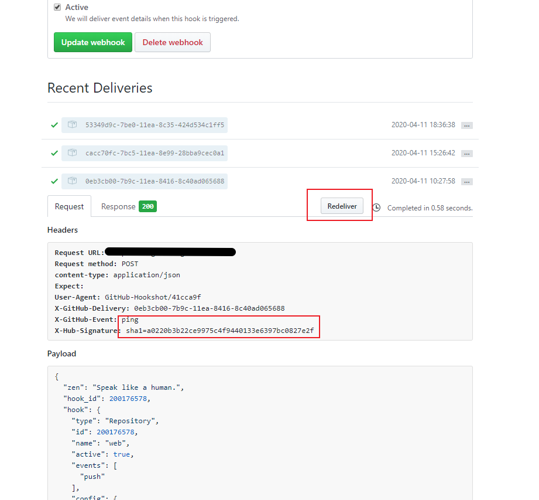

## 前言

因为博客使用 **<a href="https://www.gatsbyjs.org/" target="_blank">Gatsbyjs</a>** 进行搭建，Markdown文章写完之后会打包成静态HTML文件，文章是存在项目文件中并非数据库中，所以每次进行博客文章更新后，都需要重新进行打包构建。在进行git push后，我需要连到云服务器中，然后进入项目目录，执行git pull / npm run clean / npm run build 等命令。

为了简化该操作，通过使用Github的 **<a href="https://developer.github.com/webhooks/" target="_blank">Webhooks</a>** 服务，在服务端监听git push事件，然后自动执行编写好的脚本从而实现自动化构建部署。以后Git push后就无需再进行后续操作，由脚本完成。

目前主流的自动化构建部署工具可以选择 **<a href="https://jenkins.io/zh/" target="_blank">Jenkins</a>**，Jenkins是一个持续集成管理平台，提供超过1000个插件来支持构建、部署、自动化， 满足任何项目的需要。但由于Jenkins是基于**Java**环境，而且功能过于强大，对于个人的项目来说有点大材小用，而且加重个人服务器资源的压力。所以没有采用Jenkins进行自动化构建部署，而是采用自己编写的**Koa2**服务来接收Github Webhook来实现简单自动化构建。

## 配置Webhooks

1. 进入自己需要监听Push请求的Github仓库，点击Settings => Webhooks => Add webhook

2. 填写自己服务器请求地址，配置Secret(用于后面的Sha1解码验证)，并选择要监听的事件，本次只监听push

3. 进入到对应Webhooks详情，下方可以查看到每个请求记录，点击Redeliver可以重新发送该请求。


## 后端Koa2服务

后端的Koa2服务是本功能的最重要的环节。其处理流程：
1. 接收Github Webhooks的Post请求
2. 提取请求头与请求Body信息，并验证是否缺少必要参数
3. 使用Crypto的 **<a href="http://nodejs.cn/api/crypto.html#crypto_crypto_createhmac_algorithm_key_options" target="_blank">HMACSHA1</a>** 算法，将服务端设置的密钥对请求Body进行哈希编码，然后判断解码出来的与请求头中的x-hub-signature是否匹配，防止有他人对自己的服务器发送了伪造的非法请求或篡改了Github原请求。
4. 针对不同Git事件与Git仓库使用Nodejs的 **<a href="http://nodejs.cn/api/child_process.html" target="_blank">child_process</a>** 执行不同的脚本文件

```js{14,15,32}
const Router = require('koa-router')
const Response = require('../utils/response')
const crypto = require('crypto')
const { exec } = require('child_process')

const logger = require('../utils/log')
const { webhookSecret } = require('../config/config')

const r = new Response()
const router = new Router()

router.post('/****', async ctx => {
  const requestData = ctx.request.body
  const sig = ctx.headers['x-hub-signature']
  const event = ctx.headers['x-github-event']
  const id = ctx.headers['x-github-delivery']
  if (!sig || !event || !id) {
    ctx.body = r.error(310, 'No Github hook headers')
    return
  }
  if (!['ping', 'push'].includes(event)) {
    ctx.body = r.error(311, 'Gihub Hook events not allow')
    return
  }
  const { repository, sender } = requestData
  if (!repository || !sender) {
    ctx.body = r.error(312, 'Missing essential parameters')
    return
  }
  const { name: repositoryName } = repository
  logger('接收到Webhook', 1, `event:${event}, respository: ${repositoryName}`)
  const clientSig = `sha1=${crypto.createHmac('sha1', webhookSecret).update(JSON.stringify(requestData)).digest('hex')}`
  if (sig !== clientSig) {
    logger('Webhook X-Hub-Signature解码', 0, '解码不匹配')
    ctx.body = r.error(313, 'X-Hub-Signature does not match')
    return
  }
  if (event === 'ping') {
    ctx.body = {
      errCode: 200,
      errMsg: 'Success'
    }
  } else if (event === 'push') {
    ctx.body = {
      errCode: 200,
      errMsg: 'Success'
    }
    if (repositoryName === '****') {
      updateBlog()
    }
  }
})

const updateBlog = () => {
  exec('****.bat', (err) => {
    if (err) {
      logger('执行****.bat', 0, err)
      return
    }
    logger('执行****.bat', 1)
  })
}

module.exports = {
  githubWebhookRouter: router
}
```

在新建Webhooks后，github会发送一个ping事件到目标服务器，所以这里加多了一种ping事件的处理（直接返回200）。

本次我设置了只有push事件会发请求，所以只处理了push事件，如果设置Webhooks监听其他事件，例如issues、star等，可自行扩展对于功能。

## 备注

1. 后端可直接使用原生Nodejs搭建服务，使用 **<a href="https://github.com/rvagg/github-webhook-handler#readme" target="_blank">github-webhook-hanlder</a>** 包可快速搭建
2. 建议设置Secert密钥，防止伪造的请求
3. 本方式适合简单的前端资源自动化部署构建，对于大型的项目还是建议使用Jenkins等持续集成工具进行自动化部署
4. 可监听Github Webhooks其他事件，issue、start等，并通过 **<a href="https://developer.github.com/v3/" target="_blank">Github API</a>** 可实现下Git仓库机器人等功能

*以上内容未经授权请勿随意转载。*
