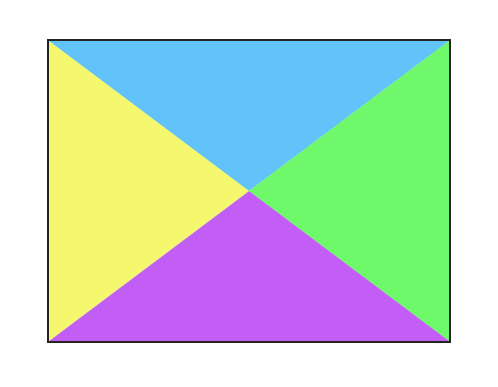
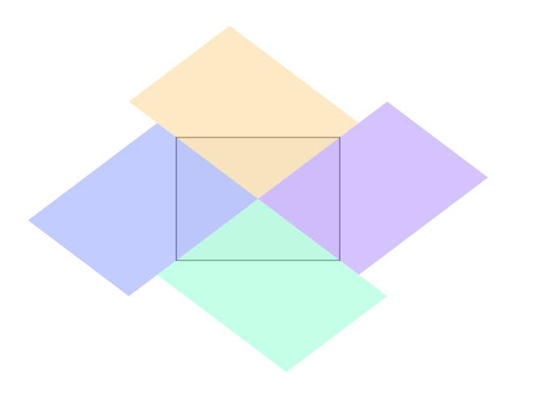

使用纯CSS判断鼠标进入方向执行不一样的方向动画，或搭配JS实现同时记录进入方向与移出方向

### 目录
1. [纯CSS实现](#纯CSS实现)
    + [Clip-path](#clip-path)
    + [Transform](#transform)
    + [总结](#总结)

## 纯CSS实现

实现纯CSS判断鼠标进入方向，主要是先通过将DIV以对角线切割为4个部分，然后即可为这4个部分写入:hover选择器执行不同方向的动画。如果DIV是正方形的话，对角线切割就很简单，可以用伪元素通过rotate(45deg)就可以实现。但是当Div是长方形的时候，就需要使用以下的方法了。



目前可以通过2种CSS3的方式实现
1. 使用CSS3的 <a href="https://developer.mozilla.org/zh-CN/docs/Web/CSS/clip-path" target="_blank">clip-path</a> 属性定向裁剪区域
2. 使用CSS3的 <a href="https://developer.mozilla.org/zh-CN/docs/Web/CSS/CSS_Transforms" target="_blank">transfrom</a> 属性，将div倾斜再旋转一定角度实现，需要同时用到rotate和skew2种2D变换。


### Clip-path

**Demo**
<iframe src="http://kongfandong.cn/demo/judge-enter-direction-by-css-clip-path.html" width="100%" height="470px" style="border: none;outline:none;box-shadow: 0 0 5px #888"></iframe>

**clip-path方式实现主要代码逻辑**

CSS
```CSS{6,42,47,52,57}
.box {
  width: 400px;
  height: 300px;
  background: #eee;
  position: relative;
  overflow: hidden;
  border: 2px solid #262626;
}
.top, .right, .bottom, .left {
  position: absolute;
  width: 100%;
  height: 100%;
  top: 0;
  left: 0;
  transition: all .4s;
}
.top:after, .right:after, .bottom:after, .left:after {
  position: absolute;
  content: '';
  width: 100%;
  height: 100%;
}
.top {
  top: -100%;
  background: rgb(255, 228, 177);
}
.right {
  right: -100%;
  left: auto;
  background: rgb(200, 177, 255);
}
.bottom {
  bottom: -100%;
  top: auto;
  background: rgb(177, 255, 225);
}
.left {
  left: -100%;
  background: rgb(177, 189, 255);
}
.top:after {
  clip-path: polygon(0 0, 50% 50%, 100% 0);
  top: 100%;
  left: 0;
}
.right:after {
  clip-path: polygon(100% 0, 50% 50%, 100% 100%);
  right: 100%;
  top: 0;
}
.bottom:after {
  clip-path: polygon(0 100%, 50% 50%, 100% 100%);
  bottom: 100%;
  left: 0;
}
.left:after {
  clip-path: polygon(0 0, 50% 50%, 0 100%);
  left: 100%;
  top: 0;
}
.top:hover {
  top: 0;
}
.right:hover {
  right: 0;
}
.bottom:hover {
  bottom: 0;
}
.left:hover {
  left: 0;
}
/* 解决层级阻断问题 */
.top:hover ~ .right,
.top:hover ~ .bottom,
.top:hover ~ .left,
.right:hover ~ .bottom,
.right:hover ~ .left,
.bottom:hover ~ .left{
  display: none;
}
```

HTML
```html
<div class="box">
  <span>Hover Here</span>
  <div class="top">From Top</div>
  <div class="right">From Right</div>
  <div class="bottom">From Bottom</div>
  <div class="left">From Left</div>
</div>
```

为.top的Div创建一个伪元素，然后使用clip-path: polygon(0 0, 50% 50%, 100% 0) 定位左上角、中心、右上角切割出上部分的三角形，这时.top实际区域是一个五边形（.top:hover时其伪元素也会包含在其中）。


### Transform

**Demo**
<iframe src="http://kongfandong.cn/demo/judge-enter-direction-by-css-transform.html" width="100%" height="470px" style="border: none;outline:none;box-shadow: 0 0 5px #888"></iframe>

transform实现方式与clip-path方式基本差不多，主要是先将伪类通过旋转加偏移变换成一个平行四边形，将变换顶点定位在中心，然后隐藏超出部分即可。



**transform方式实现主要代码逻辑** *(仅列举与clip-path不一样的代码)*

```CSS{2,15,20,25,30,35}
body {
  --angle: 37deg;
}

/*...省略部分...*/

.top:after,
.right:after,
.bottom:after,
.left:after {
  position: absolute;
  content: '';
  width: 100%;
  height: 100%;
  transform-origin: 0 0;
}
.top:after {
  top: 150%;
  left: 50%;
  transform: rotate(calc(var(--angle) - 180deg)) skew(calc((var(--angle) - 45deg) * 2));
}
.right:after {
  top: 50%;
  left: -50%;
  transform: rotate(calc(0deg - var(--angle))) skew(calc((45deg - var(--angle)) * 2));
}
.bottom:after {
  top: -50%;
  left: 50%;
  transform: rotate(var(--angle)) skew(calc((var(--angle) - 45deg) * 2));
}
.left:after {
  top: 50%;
  left: 150%;
  transform: rotate(calc(180deg - var(--angle))) skew(calc((45deg - var(--angle)) * 2));
}

/*...省略部分...*/
```

transform方式最大缺点就是需要计算角度，先将变换顶点改为0 0（原为50% 50%），就可以直接套用以上的变换公式，再使用acrtan(高/宽)计算出角度，然后赋值给--angle自定义CSS变量即可。

> PS: calc计算函数中值为0时也要带上单位，不然无法生效


### 总结

以上纯CSS实现判断方向还有一个比较大的缺点就是浏览器鼠标移动事件含有**一定延迟**，当鼠标速度很快的进入div时，有可能:hover会延迟执行到后面的元素。

同时，以上方式只可判断移入方向，还未能实现可以同时判断**移入和移出**。需要在记录移入方向的同时，再记录移出方向就只可使用JS介入了，该功能会在后面继续探讨。


**未完待续...**

